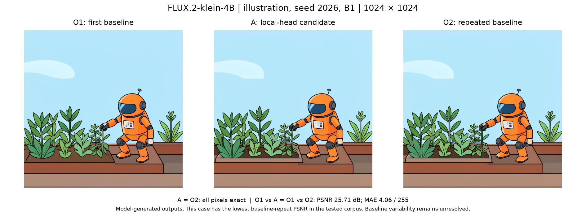

# Klein-4B local-head TP: benchmark evidence

Source base: `5f95115e703ffe51e03e40ae23c78ff841c3335e`.
Tested candidate: `39a06eac411a377e0bc1eb13bdbceb10c9783bf6`.

[Download the reproduction package](klein-local-heads-evidence.zip). It contains frozen scripts, exact model revision, public inputs, commands, numerical checks, raw component timings and per-image comparison hashes. Extract it and read `component-evidence/README.md` and `quality-evidence/README.md`. Each directory includes a SHA256 manifest.

## Measured block result

4 × NVIDIA A100-SXM4-40GB with NVLink; BF16, TP4/SP1, PyTorch 2.13.0+cu130, vLLM 0.31.0, Diffusers 0.40.0, Transformers 5.14.1, NCCL 2.29.7. FLUX.2-klein-4B revision `e7b7dc27f91deacad38e78976d1f2b499d76a294`.

Single-stream block 0 uses real checkpoint weights and synthetic activations of sequence length 4608. Compiled results use 10 warmups and 30 interleaved rounds of 5 calls, scoring the slowest rank; ± is sample standard deviation.

| Batch | Base (ms) | Candidate (ms) | Reduction |
| --- | ---: | ---: | ---: |
| 1 | 4.3357 ± 0.0092 | 2.5294 ± 0.0041 | 41.66% |
| 4 | 16.5882 ± 0.0544 | 9.4474 ± 0.0586 | 43.05% |

All 120 block comparisons across four ranks were exact and finite. Separate traces show 24→6 heads per rank and half the logical gathered output volume. The package includes slower layout-only and separate attention/MLP controls. Their changes include communication and copies; percentages are not additive.

The component measurement finished, but its outer deadline stopped the job during distributed cleanup/process exit (124). Completed measurements passed independent checks. This is a block-latency result; model-level latency and peak-memory savings remain unqualified.

## Native output check and its limit

Three fresh native services ran base/candidate/base with identical settings. Each completed 42 requests and returned 93 images, including multiple prompts, B1/B4, rectangles and single- and two-image edits. The job exited normally.

| Pair | Exact images | Different images |
| --- | ---: | ---: |
| First base / candidate | 68 | 25 |
| First base / repeated base | 68 | 25 |
| Candidate / repeated base | 93 | 0 |

All 68 B4 images match across all three runs. The 25 B1 differences are also present between the two unchanged baseline processes. The candidate's difference from the first base is exactly the same as the base-repeat difference. The strict three-way exact check **failed** and its saved status is unchanged; the cause of baseline variation remains unknown. The lowest baseline-repeat PSNR is 25.71 dB. These observations do not prove deterministic output across restarts or statistical quality equivalence.

The figure shows model-generated output, not ground truth. It is a rendered illustration of the lowest-PSNR baseline-repeat case; numerical comparisons used the original ONGs, not this figure. Prompt: “A small orange robot tending a rooftop garden, flat color illustration with clear outlines, green plants and a pale blue sky.” Seed 2026, 1024×1024, 4 steps, guidance 1.0, B1, concurrency 1, BF16, TORCH_SDPA, regional compilation.

## Other validation

Related CUDA-host CPU tests: 150 passed, 3 deselected. All applicable local pre-commit hooks passed. Test commands are included in the package. An earlier two-repeat HTTP pilot suggested roughly 21% lower latency but failed its baseline repeat control; it is excluded from the performance claim.

The source patch changes four files, including focused tests. This separate evidence branch keeps benchmark artifacts out of the upstream code diff. Private paths and machine identifiers were removed from publication copies; numerical data, model/source identities and harness content hashes were preserved. No model weights are included.

AI assistance: Codex helped implement, test, benchmark, analyze and document this contribution.
